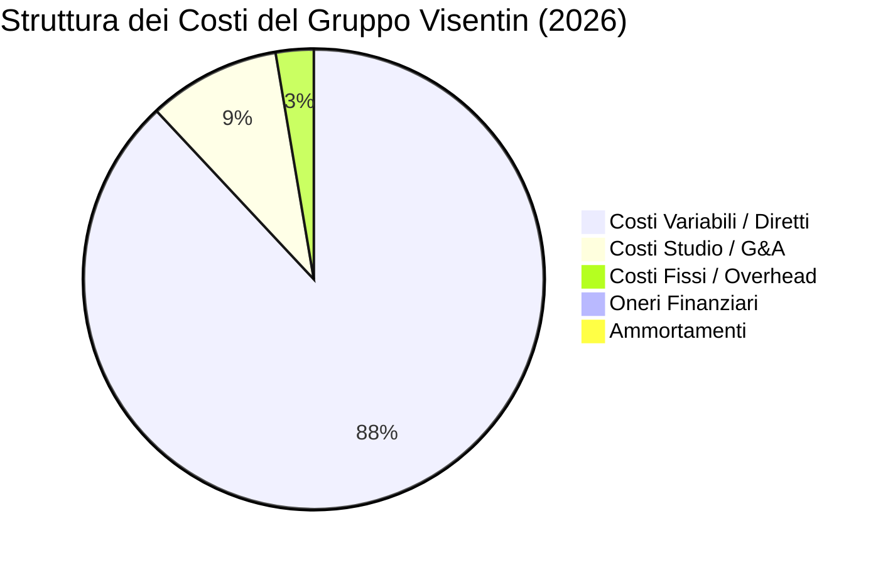

# REPORT DI AUDIT E ANALISI DELLA CONGRUITÀ DEI COSTI
**GRUPPO VISENTIN S.R.L. — ANNO FISCALE 2026**  
*Documento di Analisi Strategico-Finanziaria ad uso della Direzione Generale*

---

## 1. Introduzione ed Executive Summary

L'attuale report costituisce un audit finanziario e di congruità dei costi basato sulle transazioni del piano previsionale ed operativo per l'anno fiscale **2026** del **Gruppo Visentin**. L'obiettivo è analizzare la struttura dei costi per macrocategorie, misurarne l'impatto sul fatturato e sull'EBITDA, confrontare tali metriche con le medie del settore delle **PMI Edili del Nord-Est (taglia 5-15 collaboratori/dipendenti, fatturato 4-5 mln €)** e fornire raccomandazioni correttive concrete.

### Principali Indicatori Sintetici (2026):
*   **Fatturato (Ricavi Core):** € 4.642.349,05
*   **Margine di Contribuzione (Primo Margine):** € 923.588,12 (19,90% del fatturato)
*   **EBITDA:** € 418.553,93 (9,02% del fatturato)
*   **Risultato Operativo (EBIT):** € 418.151,94 (9,01% del fatturato)
*   **Risultato Ante Imposte (EBT):** € 560.351,94 (12,07% del fatturato)
*   **Utile Netto Stimato:** € 379.240,21 (8,17% del fatturato)

---

## 2. Analisi della Struttura dei Costi (2026)

L'analisi riclassificata del Conto Economico evidenzia la seguente scomposizione delle spese:

### 2.1 Tabella di Sintesi delle Macrocategorie

| Macrocategoria | Valore Assoluto (€) | Incidenza sul Fatturato (%) | Dettagli Principali |
| :--- | :---: | :---: | :--- |
| **Fatturato (Ricavi Core)** | **4.642.349,05** | **100,00%** | Interamente derivante da SAL (Stato Avanzamento Lavori). |
| **Costi Variabili / Diretti** | **3.718.760,93** | **80,11%** | Subappalti (€ 2,10M), Materiali (€ 1,08M), Personale Operativo (€ 323k). |
| **Costi Studio / G&A** | **392.519,57** | **8,46%** | Compensi Amministratori (€ 200k), Stipendi/Contributi Ufficio (€ 136k). |
| **Costi Fissi / Overhead** | **112.514,62** | **2,42%** | Affitti/Utenze (€ 27k), Assicurazioni (€ 20k), Commercialista (€ 16k). |
| **Ammortamenti** | **401,99** | **0,01%** | Struttura ad asset proprietari minimi (preferenza noleggi/leasing). |
| **Oneri Finanziari** | **19.800,00** | **0,43%** | Commissioni e bolli bancari, interessi passivi su affidamenti. |
| **Proventi Finanziari** | **162.000,00** | **-3,49%** | Ritorno da investimenti extragestione / dividendi distribuiti. |
| **Straordinario (Penali/Sanzioni)** | **-6.020,28** | **0,13%** | Sanzioni amministrative, donazioni ed esborsi non ordinari. |

### 2.2 Analisi Dettagliata dei Costi Variabili / Diretti (€ 3.718.760,93 — 80,11%)
La struttura dei costi diretti rivela un modello operativo fortemente **destrutturato/terzializzato**:
1.  **Subappalti su Cantiere ed Esterni (Totale € 2.100.000,00):** Rappresenta il **45,24% del fatturato** complessivo e il **56,47% dei costi variabili**. Questa è la voce di costo primaria dell'azienda.
2.  **Acquisto Materiali (€ 1.080.000,00):** Rappresenta il **23,26% del fatturato**. L'incidenza combinata di subappalti e materiali drena il 68,5% delle entrate prima ancora di computare la manodopera interna.
3.  **Personale Operativo Diretto (€ 323.879,11):** Di cui € 142k di stipendi e € 181k di contributi/oneri sociali. L'incidenza del personale operativo interno è limitata al **6,98% del fatturato**, confermando che il Gruppo Visentin agisce principalmente come general contractor / coordinatore di commesse piuttosto che con maestranze proprie massive.

### 2.3 Analisi dei Costi Studio / Gestione Amministrativa (€ 392.519,57 — 8,46%)
Racchiude il costo del personale di ufficio (tecnici, preventivisti, segreteria) e i compensi societari:
*   **Compenso Amministratori / Soci:** € 199.680,00 (4,30% del fatturato).
*   **Stipendi e Contributi Personale Ufficio:** € 136.139,57.
*   **Collaboratori Fissi di Studio:** € 56.700,00.
La struttura appare snella e commisurata al volume di affari.

### 2.4 Analisi dei Costi Fissi / Overhead (€ 112.514,62 — 2,42%)
L'azienda vanta un livello di costi fissi strutturali estremamente basso:
*   **Affitti e Utenze Sedi:** € 27.645,41.
*   **Spese di Marketing e Pubblicità:** € 15.313,75.
*   **Assicurazioni Generali e Compliance:** € 20.324,70.
*   **Spese Amministrative / Commercialista:** € 15.719,22.
Questa flessibilità riduce significativamente il punto di pareggio (Break-Even Point), mitigando il rischio di insolvenza in caso di contrazione dei ricavi.

---

## 3. Valutazione di Congruità ed Analisi Benchmark (Nord-Est)

Per valutare la "bontà" di questi dati, confrontiamo i parametri del Gruppo Visentin con i benchmark settoriali delle PMI edili operanti in Veneto e Friuli-Venezia Giulia.

| Indicatore | Gruppo Visentin | Benchmark Settore PMI (Nord-Est) | Valutazione |
| :--- | :---: | :---: | :--- |
| **Primo Margine (Industrial)** | **19,90%** | **25% - 30%** | 🔴 **Sotto la media.** L'incidenza dei costi diretti è elevata (80,11%). |
| **Incidenza Subappalti** | **45,24%** | **25% - 35%** | ⚠️ **Elevata.** Forte dipendenza da fornitori terzi per le lavorazioni. |
| **Incidenza Personale Interno** | **6,98%** | **15% - 20%** | 🟢 **Molto efficiente / Leggera.** Riduce il rischio di costi fissi del personale. |
| **EBITDA Margin** | **9,02%** | **7,0% - 10,5%** | 🟢 **In linea.** La snellezza dei costi fissi compensa la pressione sul primo margine. |
| **EBIT Margin** | **9,01%** | **4,5% - 6,5%** | 🟢 **Ottimo.** L'assenza di forti ammortamenti mantiene elevato il reddito operativo. |
| **Oneri Finanziari / Ricavi** | **0,43%** | **1,5% - 2,5%** | 🟢 **Eccellente.** Autonomia finanziaria e basso indebitamento bancario generativo. |

### Giudizio di Congruità sui Costi:
1.  **Costi Variabili (Giudizio: Critico ma Gestibile):** L'80,11% è una percentuale rischiosa. In caso di lievi aumenti dei prezzi delle materie prime o di contenziosi con i subappaltatori, il margine industriale rischia di azzerarsi. Il Gruppo Visentin è "salvato" dal fatto che i costi fissi sono minimi.
2.  **Costi Studio e Compenso Soci (Giudizio: Congruo):** Un compenso amministratori di circa € 200.000 su € 4,6M di fatturato (pari al 4,3%) è del tutto allineato con le prassi di mercato delle S.r.l. sane nel Nord-Est. Inoltre, la distribuzione di utili extra (€ 126k lordi) evidenzia una buona capacità di remunerazione del capitale.
3.  **Oneri Finanziari (Giudizio: Ottimo):** Lo 0,43% indica che la gestione del capitale circolante è ottimale e che i fidi di cassa sono utilizzati con parsimonia. I proventi finanziari (€ 162k) indicano inoltre una gestione attiva della liquidità eccellente.

---

## 4. Raccomandazioni Strategiche ed Azioni Correttive

Per proteggere la marginalità operativa e ottimizzare l'allocazione delle risorse, si suggeriscono le seguenti azioni correttive immediate:

### 🎯 4.1 Target Pricing e Negoziazione Acquisti (Obiettivo: Ridurre Costi Variabili dal 80% al 75%)
*   **Standardizzazione dei contratti di subappalto:** Inserire clausole di "Prezzo Chiuso" non revisionabile se non per varianti espressamente approvate dalla committenza.
*   **Gruppi d'acquisto e stoccaggio preventivo:** Negoziare l'acquisto del ferro, cemento e isolanti su base annuale con contratti quadro per bloccare i prezzi e ridurre l'incidenza dei materiali (attualmente al 23,26%).
*   **Analisi delle varianti in corso d'opera:** Monitorare settimanalmente i SAL dei subappaltatori rispetto al SAL attivo emesso per evitare di pagare lavorazioni extra non riconosciute dal cliente finale.

### 🏦 4.2 Ottimizzazione Finanziaria e Gestione Fidi
*   **Rinegoziazione Commissioni Bancarie:** Sebbene gli oneri finanziari siano bassi (€ 19,8k), la voce è interamente composta da "Commissioni e bolli". È necessario mappare le commissioni di massimo scoperto e i costi di istruttoria delle linee di firma (fideiussioni per appalti) ed effettuare una gara tra i principali 3 istituti affidatari per ridurre le spese fisse di tenuta conto.
*   **Mantenimento della PFN Positiva:** Utilizzare la liquidità che genera i proventi finanziari (€ 162k) come collaterale per ottenere tassi d'interesse agevolati sulle linee di credito a breve termine (anticipo fatture/contratti).

### 🏗️ 4.3 Gestione dei Subappalti e Controllo di Gestione
*   **Rating dei Subappaltatori:** Creare un albo fornitori interno valutato non solo sul prezzo, ma sul rispetto dei tempi e sulla qualità (minor tasso di contestazioni post-consegna).
*   **Pianificazione Flussi di Cassa per Commessa:** Sincronizzare i termini di pagamento dei subappaltatori (es. 90 gg D.F.) con i termini di incasso dei SAL attivi (es. 60 gg D.F.) per mantenere un cash flow operativo costantemente positivo, riducendo a zero la necessità di ricorso allo smobilizzo crediti oneroso.

---
*Fine del Report.*
